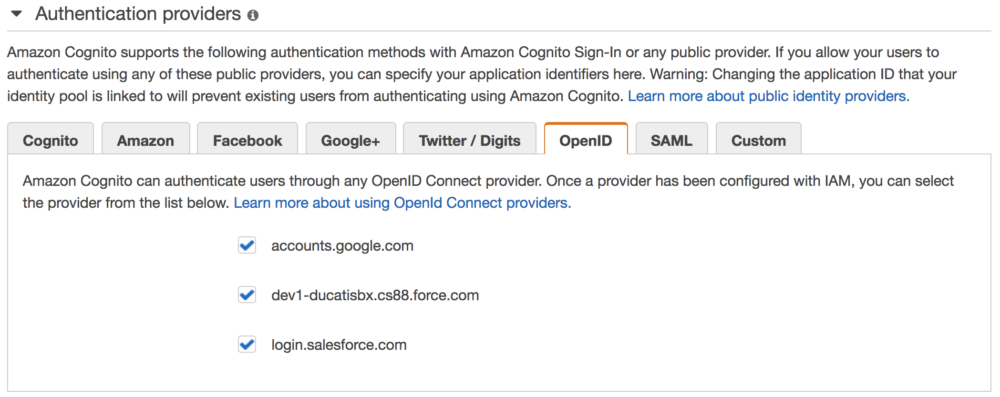

# Amazon Cognito - Open ID Connect Providers

OpenID Connect is an open standard for authentication that is supported by a number of login providers. Amazon Cognito supports linking of identities with OpenID Connect providers that are configured through AWS Identity and Access Management.

## Setting Google Identity Provider
Before your application can use Google's OAuth 2.0 authentication system for user login, you must set up a project in the Google API Console to obtain OAuth 2.0 credentials, set a redirect URI, and (optionally) customize the branding information that your users see on the user-consent screen  
https://developers.google.com/identity/protocols/OpenIDConnect

### Obtain OAuth 2.0 credentials
You need OAuth 2.0 credentials, including a client ID and client secret, to authenticate users and gain access to Google's APIs.  

Thi is an example:
- Provider URL: accounts.google.com
- Audience: 123456789-abcdefghilmnopqrstuvxyz.apps.googleusercontent.com

## Adding an OpenID Connect Provider to IAM

OIDC identity providers are entities in IAM that describe an identity provider (IdP) service that supports the OpenID Connect (OIDC) standard. You can create a OpenID Connect Identity Provider as described here:  
https://docs.aws.amazon.com/IAM/latest/UserGuide/id_roles_providers_create_oidc.html

## Associating a Provider to Amazon Cognito
Once you've created an OpenID Connect provider in the IAM Console, you can associate it to an identity pool. All configured providers will be visible in the Edit Identity Pool screen in the Amazon Cognito Console under the OpenID Connect Providers header.

Authorized JavaScript origins from S3
http://refopenind.xpeppers.com.s3-website-eu-west-1.amazonaws.com/

Setting S3 Cors ?

Setting OpenID provider
http://docs.aws.amazon.com/IAM/latest/UserGuide/id_roles_providers_create_oidc.html

## Virtual Environment
virtualenv -p python3 openid
source openid/bin/activate

## Install Dependencies
pip install requests-aws4auth
