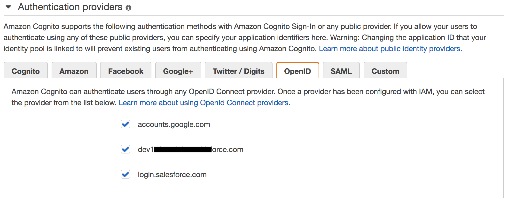

# Amazon Cognito - Open ID Connect Providers

OpenID Connect is an open standard for authentication that is supported by a number of login providers. Amazon Cognito supports linking of identities with OpenID Connect providers that are configured through AWS Identity and Access Management. OpenID is based on [Oauth2](.OAuth2.md)

## Setting Google Identity Provider
Before your application can use Google's OAuth 2.0 authentication system for user login, you must set up a project in the Google API Console to obtain OAuth 2.0 credentials, set a redirect URI, and (optionally) customize the branding information that your users see on the user-consent screen. Google support [OpenID Connect](
https://developers.google.com/identity/protocols/OpenIDConnect)

### Obtain OAuth 2.0 credentials
You need OAuth 2.0 credentials, including a client ID and client secret, to authenticate users and gain access to Google's APIs.   
This is an example:
- Provider URL: accounts.google.com
- Client ID: 123456789-abcdefghilmnopqrstuvxyz.apps.googleusercontent.com
- Client Secret: abcdefghilmnopqrstuvxy

You need to set an Authorized redirect URIs, for Example https://www.getpostman.com/oauth2/callback

## Adding an OpenID Connect Provider to IAM

OIDC identity providers are entities in IAM that describe an identity provider (IdP) service that supports the OpenID Connect (OIDC) standard. You can create a OpenID Connect Identity Provider as described [here](  
https://docs.aws.amazon.com/IAM/latest/UserGuide/id_roles_providers_create_oidc.html)

## Create Amazon Cognito Federated Identities
Amazon Cognito Federated Identities enable you to create unique identities and assign permissions for users. [More info](
https://docs.aws.amazon.com/cognito/latest/developerguide/getting-started-with-identity-pools.html)

### Associating a Provider to Amazon Cognito
Once you've created an OpenID Connect provider in the IAM Console, you can associate it to an identity pool. All configured providers will be visible in the Edit Identity Pool screen in the Amazon Cognito Console under the OpenID Connect Providers header.



### Cognito - GetCredentialsForIdentity API
Returns credentials for the provided identity ID. Any provided logins will be validated against supported login providers. After validation the STS return a default role or custom role (only for identity providers that support role customization as SAML2) to Cognito and Cognito sent this to end user. [More info](https://docs.aws.amazon.com/cognitoidentity/latest/APIReference/API_GetCredentialsForIdentity.html)


The GetCredentialsForIdentity API can be called after you establish an identity ID. This API is functionally equivalent to calling GetOpenIdToken followed by AssumeRoleWithWebIdentity.

**Note** At this moment Cognito GetCredentialsForIdentity API on OpenID Connect identity provider (as SalesForce) not support role mapping rule then support only two roles: Authenticated and UnAuthenticated.

```
{
    "IdentityPoolId": "eu-west-1:123456789-123456789-123456789-123456789",
    "Roles": {
        "unauthenticated": "arn:aws:iam::123456789:role/Cognito_Test_UnAuthRole",
        "authenticated": "arn:aws:iam::123456789:role/Cognito_Test_AuthRole"
    }
}
```


### STS - AssumeRoleWithWebIdentity API

Returns a set of temporary security credentials for users who have been authenticated in a mobile or web application with a web identity provider, such as Amazon Cognito, Login with Amazon, Facebook, Google, or any OpenID Connect-compatible identity provider. [More info](https://docs.aws.amazon.com/STS/latest/APIReference/API_AssumeRoleWithWebIdentity.html)

If you want to exchange a OpenID token coming from Cognito with STS you need to invoke the [GetOpenIdToken](https://docs.aws.amazon.com/cognitoidentity/latest/APIReference/API_GetOpenIdToken.html) API


### Role-Based Access Control
Amazon Cognito Federated Identities assigns your authenticated users a set of temporary, limited privilege credentials to access your AWS resources. You can define rules to choose the role for each user based on claims in the user's ID token. To enable Role-Based Access Control and allows federated users from cognito-identity.amazonaws.com (the issuer of the OpenID Connect token) to assume this role. you need to create a role with a

## Configure iam

Before you can create a role for web identity federation, you must first complete the following prerequisite steps.

### Configure Trusted Relationship

When you use Amazon Cognito to manage identities you must set a trust policy to permit user coming from Identity Provider (the issuer of the OpenID Connect token) to assume the role

```
{
  "Version": "2012-10-17",
  "Statement": [
    {
      "Effect": "Allow",
      "Principal": {
        "Federated": "arn:aws:iam::AWS_ACCOUNT_ID:oidc-provider/accounts.google.com"
      },
      "Action": "sts:AssumeRoleWithWebIdentity",
      "Condition": {
        "StringEquals": {
          "accounts.google.com:aud": "OAUTH2_CLIENT_ID"
        }
      }
    }
  ]
}
```
And The policy associated with This

### Configure IAM Policy
```
{
    "Version": "2012-10-17",
    "Statement": [
        {
            "Sid": "VisualEditor0",
            "Effect": "Allow",
            "Action": "*",
            "Resource": "*",
            "Condition": {
                "StringEquals": {
                    "accounts.google.com:sub": "111501939861489290614"
                }
            }
        }
    ]
}
```

## Create Virtual Environment

```
virtualenv -p python3 openid
source openid/bin/activate
```

### Install Dependencies
```
pip install httplib2
pip install boto3
pip install requests
pip install requests-aws4auth
```

### Setting OAUTH2 credential
```
export OAUTH2_CLIENT_ID="123456789-abcdefghilmnopqrstuvxyz.apps.googleusercontent.com"  
export OAUTH2_CLIENT_SECRET="abcdefghilmnopqrstuvxy"
export AWS_ACCOUNT_ID="12345678910"
export COGNITO_POOL_ID="eu-west-1:abcdefg-abcdefg-abcdefg-abcdefg-abcdefg"
```

### Launch the Google demo
 ```
 python google-oauth2.py
 ```

### Launch the SalesForce demo
```
python salesforce-oauth2.py
```
