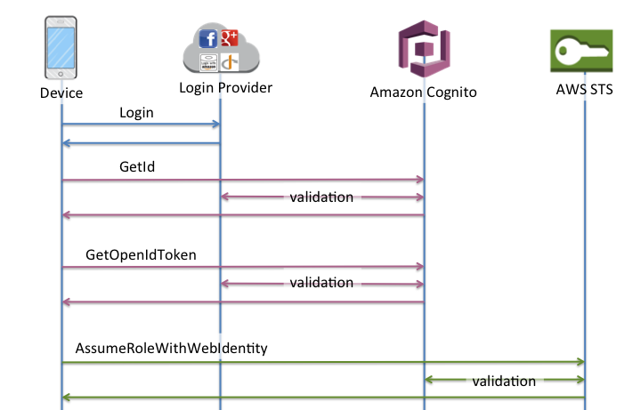

# Amazon Cognito - Open ID Connect Providers

OpenID Connect is an open standard for authentication that is supported by a number of login providers. Amazon Cognito supports linking of identities with OpenID Connect providers that are configured through AWS Identity and Access Management. OpenID is based on [Oauth2](.OAuth2.md)

## Setting Google Identity Provider
Before your application can use Google's OAuth 2.0 authentication system for user login, you must set up a project in the Google API Console to obtain OAuth 2.0 credentials, set a redirect URI, and (optionally) customize the branding information that your users see on the user-consent screen. Google support [OpenID Connect](
https://developers.google.com/identity/protocols/OpenIDConnect)

### Obtain OAuth 2.0 credentials
You need OAuth 2.0 credentials, including a client ID and client secret, to authenticate users and gain access to Google's APIs.   
This is an example:
- Provider URL: accounts.google.com
- Client ID: 123456789-abcdefghilmnopqrstuvxyz.apps.googleusercontent.com
- Client Secret: abcdefghilmnopqrstuvxy

You need to set an Authorized redirect URIs, for Example https://www.getpostman.com/oauth2/callback

## Adding an OpenID Connect Provider to IAM

OIDC identity providers are entities in IAM that describe an identity provider (IdP) service that supports the OpenID Connect (OIDC) standard. You can create a OpenID Connect Identity Provider as described [here](  
https://docs.aws.amazon.com/IAM/latest/UserGuide/id_roles_providers_create_oidc.html)

## Create Amazon Cognito Federated Identities
Amazon Cognito Federated Identities enable you to create unique identities and assign permissions for users. [More info](
https://docs.aws.amazon.com/cognito/latest/developerguide/getting-started-with-identity-pools.html)

During the Identity Federation Wizard Cognito will create two roles: *Authorized* and *UnAuthorized*.
This two role has a following IAM Policies

**Authenticated IAM Policies**
```
{
    "Version": "2012-10-17",
    "Statement": [
        {
            "Effect": "Allow",
            "Action": [
                "mobileanalytics:PutEvents",
                "cognito-sync:*"
            ],
            "Resource": [
                "*"
            ]
        }
    ]
}
```

**UnAuthenticated IAM Policies**

```
{
    "Version": "2012-10-17",
    "Statement": [
        {
            "Effect": "Allow",
            "Action": [
                "mobileanalytics:PutEvents",
                "cognito-sync:*"
            ],
            "Resource": [
                "*"
            ]
        }
    ]
}
```

The Amazon Cognito console will create these for you by default when you first set up your identity pool. The access policy for these two roles will be exactly the same: it will grant users access to Amazon Cognito Sync as well as to submit events to Amazon Mobile Analytics. You are welcome and encouraged to modify these roles to meet your needs. This two role has the following Trusted Relationship

**Authenticated Trust Relationship**

```
{
  "Version": "2012-10-17",
  "Statement": [
    {
      "Effect": "Allow",
      "Principal": {
        "Federated": "cognito-identity.amazonaws.com"
      },
      "Action": "sts:AssumeRoleWithWebIdentity",
      "Condition": {
        "StringEquals": {
          "cognito-identity.amazonaws.com:aud": "eu-west-1:123456-123456-123456-123456-123456"
        },
        "ForAnyValue:StringLike": {
          "cognito-identity.amazonaws.com:amr": "authenticated"
        }
      }
    }
  ]
}
```

**UnAuthenticated Trust Relationship**

```
{
  "Version": "2012-10-17",
  "Statement": [
    {
      "Effect": "Allow",
      "Principal": {
        "Federated": "cognito-identity.amazonaws.com"
      },
      "Action": "sts:AssumeRoleWithWebIdentity",
      "Condition": {
        "StringEquals": {
          "cognito-identity.amazonaws.com:aud": "eu-west-1:123456-123456-123456-123456-123456"
        },
        "ForAnyValue:StringLike": {
          "cognito-identity.amazonaws.com:amr": "unauthenticated"
        }
      }
    }
  ]
}
```
This relationship is necessary for guarantee that only users from this Cognito Identity Federation can assume this roles.

### Associating a Provider to Amazon Cognito
Once you've created an OpenID Connect provider in the IAM Console, you can associate it to an identity pool. All configured providers will be visible in the Edit Identity Pool screen in the Amazon Cognito Console under the OpenID Connect Providers header.


### Cognito - Implement Enhanced (Simplified) Authflow

The Enhanced (Simplified) Authflow is completed with two API call:
1. *GetId:* The GetId API call is the first call necessary to establish a new identity in Amazon Cognito
2. *GetCredentialsForIdentity:* The GetCredentialsForIdentity API can be called after you establish an identity ID. This API is functionally equivalent to calling GetOpenIdToken followed by AssumeRoleWithWebIdentity.


#### Cognito GetCredentialsForIdentity API
Returns credentials for the provided identity ID. Any provided logins will be validated against supported login providers. After validation the STS return a default role or custom role (only for identity providers that support role customization as SAML2) to Cognito and Cognito sent this to end user. [More info](https://docs.aws.amazon.com/cognitoidentity/latest/APIReference/API_GetCredentialsForIdentity.html)

**Note:** At this moment Cognito GetCredentialsForIdentity API on OpenID Connect identity provider (as SalesForce) not support role mapping rule then support only two roles: Authenticated and UnAuthenticated.

```
{
    "IdentityPoolId": "eu-west-1:123456789-123456789-123456789-123456789",
    "Roles": {
        "unauthenticated": "arn:aws:iam::123456789:role/Cognito_Test_UnAuthRole",
        "authenticated": "arn:aws:iam::123456789:role/Cognito_Test_AuthRole"
    }
}
```

### Cognito - Implement Basic (Classic) Authflow

The Basic (Classic) Authflow is completed with three API call:
1. *GetId:* The GetId API call is the first call necessary to establish a new identity in Amazon Cognito
2. *GetOpenIdToken:* The GetOpenIdToken API call is called after you establish an identity ID. If you have a cached identity ID, this can be the first call you make during an app session.
3. *AssumeRoleWithWebIdentity:* Once you have an OpenID Connect token, you can then trade this for temporary AWS credentials via the AssumeRoleWithWebIdentity API call in AWS Security Token Service (STS)



#### STS AssumeRoleWithWebIdentity API

Returns a set of temporary security credentials for users who have been authenticated in a mobile or web application with a web identity provider, such as Amazon Cognito, Login with Amazon, Facebook, Google, or any OpenID Connect-compatible identity provider. [More info]((https://docs.aws.amazon.com/STS/latest/APIReference/API_AssumeRoleWithWebIdentity.html)

**Note:** In Cognito Basic (Classic) Authflow, the call on STS is no different than if you were using Facebook, Google+, or Login with Amazon directly, except that you are passing an Amazon Cognito token instead of a token from one of the other public providers.

## Configure API gateway
You can use the API Gateway Import API feature to import an API from an external definition file into API Gateway. Currently, the Import API feature supports Swagger v2.0 definition files.  

Follow this [instruction](https://docs.aws.amazon.com/apigateway/latest/developerguide/import-export-api-endpoints.html) for import a swagger file [API Gateway json](./apigateway.json)

Follow this [instruction](https://docs.aws.amazon.com/apigateway/latest/developerguide/how-to-mock-integration.html) to create a Mock on API gateway

On Integration Response from Method Execution. Expand the 200 response and then the Body Mapping Templates section. Choose or add an application/json mapping template and type the following response body mapping template in the template editor.

```
{
    "statusCode": 200,
    "message": "Go ahead without me"
}
```
## Configure IAM
In the process of creating an identity pool, you'll be prompted to update the IAM roles that your users assume. IAM roles work like this: When a user logs in to your app, Amazon Cognito generates temporary AWS credentials for the user. These temporary credentials are associated with a specific IAM role. The IAM role lets you define a set of permissions to access your AWS resources.

### Configure IAM for GetCredentialsForIdentity API

Now you must to Control who can invoke the protected API, creating an IAM policy document with required permissions. This policie will be attached to **Authenticated Role** created before during Cognito configuration.

```
{
  "Version": "2012-10-17",
  "Statement": [
    {
      "Effect": "Permission",
      "Action": [
        "execute-api:Invoke"           
      ],
      "Resource": [
        "arn:aws:execute-api:region:account-id:api-id/stage/METHOD_HTTP_VERB/Resource-path"
      ]
    }
  ]
}
```

### Configure IAM for AssumeRoleWithWebIdentity API

Calling AssumeRoleWithWebIdentity does not require the use of AWS security credentials. Therefore, you can distribute an application (for example, on mobile devices) that requests temporary security credentials without including long-term AWS credentials in the application, and without deploying server-based proxy services that use long-term AWS credentials. Before your application can call AssumeRoleWithWebIdentity, you must have an identity token from a supported identity provider and create a [Role for Web Identity](https://docs.aws.amazon.com/IAM/latest/UserGuide/id_roles_create_for-idp_oidc.html) that the application can assume.

This role must to have the IAM policie necessary to invoke the API Gateway resource.


```
{
  "Version": "2012-10-17",
  "Statement": [
    {
      "Effect": "Permission",
      "Action": [
        "execute-api:Invoke"           
      ],
      "Resource": [
        "arn:aws:execute-api:region:account-id:api-id/stage/METHOD_HTTP_VERB/Resource-path"
      ]
    }
  ]
}
```

The role that your application assumes must trust the user that is associated with the identity token. In other words, the identity provider or user must be specified in the role's trust policy.

```
{
  "Version": "2012-10-17",
  "Statement": [
    {
      "Effect": "Allow",
      "Principal": {
        "Federated": "arn:aws:iam::103204280208:oidc-provider/accounts.google.com"
      },
      "Action": "sts:AssumeRoleWithWebIdentity",
      "Condition": {
        "StringEquals": {
          "accounts.google.com:aud": "428995339229-bbb0jict0t2hiaja5jh5j3sqs5uco0gc.apps.googleusercontent.com"
        }
      }
    }
  ]
}
```

The Condition element of an JSON policy in IAM allows you to test the value of keys that are included in the evaluation context of all AWS API requests. The Keys available are explained [here](https://docs.aws.amazon.com/IAM/latest/UserGuide/reference_policies_condition-keys.html#condition-keys-wif)

https://docs.aws.amazon.com/IAM/latest/UserGuide/list_sts.html

## Create Virtual Environment

```
virtualenv -p python3 openid
source openid/bin/activate
```

### Install Dependencies
```
pip install httplib2
pip install boto3
pip install requests
pip install requests-aws4auth
```

### Setting Environment
```
export OAUTH2_CLIENT_ID=123456789-abcdefghilmnopqrstuvxyz.apps.googleusercontent.com
export OAUTH2_CLIENT_SECRET=abcdefghilmnopqrstuvxy
export AWS_ACCOUNT_ID=12345678910
export COGNITO_POOL_ID=eu-west-1:abcdefg-abcdefg-abcdefg-abcdefg-abcdefg
export AWS_REGION=eu-west-1
export STS_ROLE_ARN=arn:aws:::test
export AWS_SERVICE="execute-api"
export API_URI=https://123456789.execute-api.eu-west-1.amazonaws.com/dev/bike/test
```

### Launch the Google demo
 ```
 python google-oauth2.py
 ```

### Launch the SalesForce demo
```
python salesforce-oauth2.py
```

Creare ruolo per Assume Role con Variabili
https://docs.aws.amazon.com/IAM/latest/UserGuide/id_roles_create_for-idp_oidc.html
https://docs.aws.amazon.com/IAM/latest/UserGuide/id_roles_providers_oidc_user-id.html
